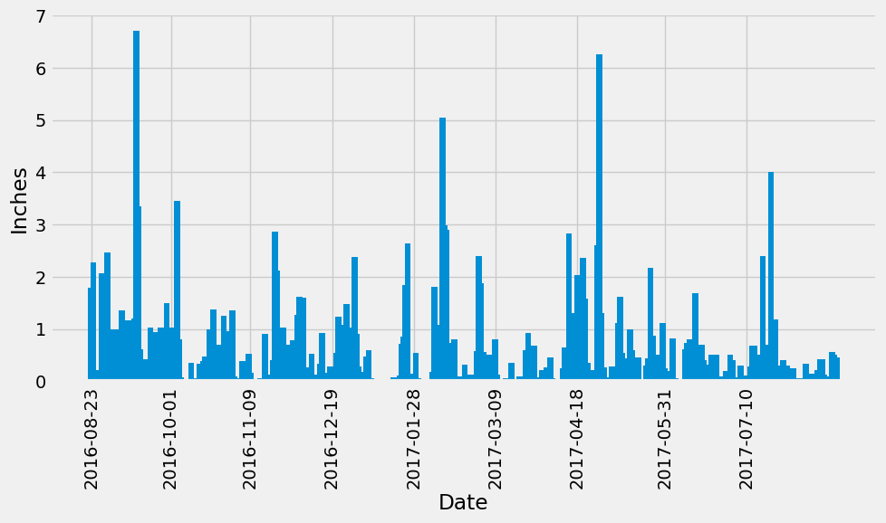
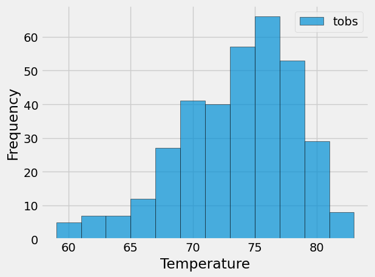

## sqlalchemy-challenge
## Instructions
In this challenge I was awarded a mock trip to Hawaii.  To help plan the trip I performed a climate analysis of the area. 
The following sections ouline the steps I took to accomplish this task.

## Part 1: Analyzing and exploring climate data
I used Python and SQLAlchemy to do a basic climate analysis and data exploration of the climate database. Specifically, I used SQLAlchemy, ORM queries, Pandas, and Matplotlib to complete the following steps:  
1. Use the provided files (climate_starter.ipynb and hawaii.sqlite) to complete the climate analysis and data exploration.  

2.  Use the SQLAlchemy create_engine() function to connect to your SQLite database.
3.  Use the SQLAlchemy automap_base() function to reflect your tables into classes, and then save references to the classes named station and measurement.
4.  Link Python to the database by creating a SQLAlchemy session.

5.  Perform a precipitation analysis and then a station analysis by completing the steps in the following two subsections.
### Precipitation Analysis
1.  Find the most recent date in the dataset.

2. Using that date, get the previous 12 months of precipitation data by querying the previous 12 months of data.

3.  Select only the "date" and "prcp" values.
4.  Load the query results into a Pandas DataFrame. Explicitly set the column names.
5.  Sort the DataFrame values by "date".
6.  Plot the results by using the DataFrame plot method, as the following image shows:

7. Use Pandas to print the summary statistics for the precipitation data.

### Station Analysis
1.  Design a query to calculate the total number of stations in the dataset.
2.  Design a query to find the most-active stations (that is, the stations that have the most rows). To do so, complete the following steps: 

    - List the stations and observation counts in descending order.  

    - Answer the following question: which station id has the greatest number of observations?

3.  Design a query that calculates the lowest, highest, and average temperatures that filters on the most-active station id found in the previous query.

4.  Design a query to get the previous 12 months of temperature observation (TOBS) data. To do so, complete the following steps:
    - Filter by the station that has the greatest number of observations.

    - Query the previous 12 months of TOBS data for that station.

    - Plot the results as a histogram with bins=12, as the following image shows:

5.  Close your session.
## Part 2: Design Your Climate App
Design a Flask API based on the queries that you just developed. To do so, use Flask to create your routes as follows:
1.  /
    - Start at the homepage.
    - List all the available routes.

2.  /api/v1.0/precipitation

    - Convert the query results from your precipitation analysis (i.e. retrieve only the last 12 months of data) to a dictionary using date as the key and prcp as the value.
    - Return the JSON representation of your dictionary.

3.  /api/v1.0/stations
    - Return a JSON list of stations from the dataset.
4.  /api/v1.0/tobs
    - Query the dates and temperature observations of the most-active station for the previous year of data.
    - Return a JSON list of temperature observations for the previous year.

5.  /api/v1.0/ and /api/v1.0/
    - Return a JSON list of the minimum temperature, the average temperature, and the maximum temperature for a specified start or start-end range.
    - For a specified start, calculate TMIN, TAVG, and TMAX for all the dates greater than or equal to the start date.
    - For a specified start date and end date, calculate TMIN, TAVG, and TMAX for the dates from the start date to the end date, inclusive.
## Analysis
In a year's worth of data the precipitation levels were the highest in
August and May, which are months I would avoid traveling to Hawaii.
The temperature analysis shows an average temperature of 71 degrees with a low of 54
and a high of 85.  This information doesn't really help me to determine what month 
would be the best to visit regarding temperature. If I did further analysis I would
look for months with average temperatures in the 70s and low precipitation.

